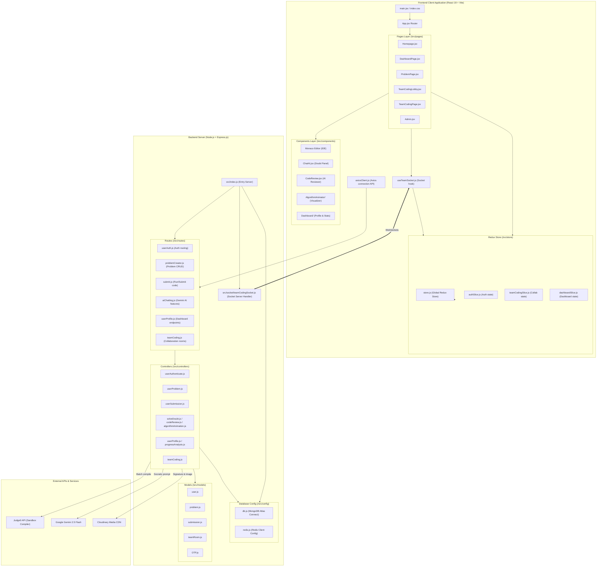

# 📂 CodeMaster: Complete Project Structure & Dependency Flow

This document details the complete code structure, file hierarchy, and module dependency workflows for the **CodeMaster** application. It serves as a visual and descriptive guide to understanding how files, components, state management slices, and backend endpoints relate to one another.

---

## 🗺️ 1. Global Structure Flow Diagram

Below is the architectural dependency tree, illustrating how requests navigate from the client interface down to the database and external compiling sandboxes.

---

## 📂 2. File & Folder Explanation

### A. Frontend Layer (`frontend/`)

1.  **`main.jsx` & `App.jsx`**:
    *   `main.jsx` initializes React, binds standard styling sheets, and mounts the Redux Store wrapper.
    *   `App.jsx` declares client-side endpoints and renders protective route wraps based on authentication state.
2.  **`pages/`**:
    *   **[Homepage.jsx](file:///c:/Users/alamk/OneDrive/Desktop/CodeMaster/frontend/src/pages/Homepage.jsx)**: Lists problem sets, holds filtering parameters (tag selectors, difficulty chips), and serves video lectures.
    *   **[ProblemPage.jsx](file:///c:/Users/alamk/OneDrive/Desktop/CodeMaster/frontend/src/pages/ProblemPage.jsx)**: Splits views into instructions, compiler consoles, AI reviews, and doubt-solver chats.
    *   **[TeamCodingLobby.jsx](file:///c:/Users/alamk/OneDrive/Desktop/CodeMaster/frontend/src/pages/TeamCodingLobby.jsx)** & **[TeamCodingPage.jsx](file:///c:/Users/alamk/OneDrive/Desktop/CodeMaster/frontend/src/pages/TeamCodingPage.jsx)**: Manages team lobby entries and mounts the collaborative Monaco editor workspace.
3.  **`components/`**:
    *   **`AlgorithmAnimator/`**: Manages step-by-step visual animation rendering and quiz validation.
    *   **`Dashboard/`**: Renders profile metrics, responsive stats widgets, and customized settings forms.
4.  **`store/`**:
    *   Provides centralized global states:
        *   `authSlice.js` $\rightarrow$ checks session validity.
        *   `teamCodingSlice.js` $\rightarrow$ handles live client state syncs.
        *   `dashboardSlice.js` $\rightarrow$ retrieves user data.
5.  **`hooks/useTeamSocket.js`**:
    *   Registers listeners for Socket.IO events and emits debounced user code updates.
6.  **`utils/axiosClient.js`**:
    *   Configures Axios with default configurations and intercepts outbound requests to attach credentials automatically.

---

### B. Backend Layer (`Backend/`)

1.  **`index.js`**:
    *   Initializes the Express server, binds security middlewares (CORS settings, Cookie Parser, rate limiters), registers API routers, and connects to databases.
2.  **`config/`**:
    *   `db.js` $\rightarrow$ Sets up MongoDB connection pools.
    *   `redis.js` $\rightarrow$ Initiates connections to Redis Cloud instances.
3.  **`routes/` & `controllers/`**:
    *   **`userAuth.js` / `userAuthenticate.js`**: Coordinates OTP creation, password resets, registration audits, and login handlers.
    *   **`submit.js` / `userSubmission.js`**: Batches user test cases and evaluates them via Judge0 compile containers.
    *   **`aiChatting.js` / `solveDoubt.js` / `codeReview.js` / `algorithmAnimation.js`**: Interfaces with Google Gemini 2.5 Flash SDKs.
4.  **`models/`**:
    *   Stores structural criteria:
        *   `user.js` $\rightarrow$ Bio data, solved sets, details.
        *   `problem.js` $\rightarrow$ Starter code strings, test descriptions.
        *   `submission.js` $\rightarrow$ Historical logs, runtime details.
        *   `teamRoom.js` $\rightarrow$ Chat buffers, collab states.
        *   `OTP.js` $\rightarrow$ Transient code verifications.
5.  **`socket/teamCodingSocket.js`**:
    *   Authorizes inbound socket handshakes via verified JWTs and broadcasts real-time events.
